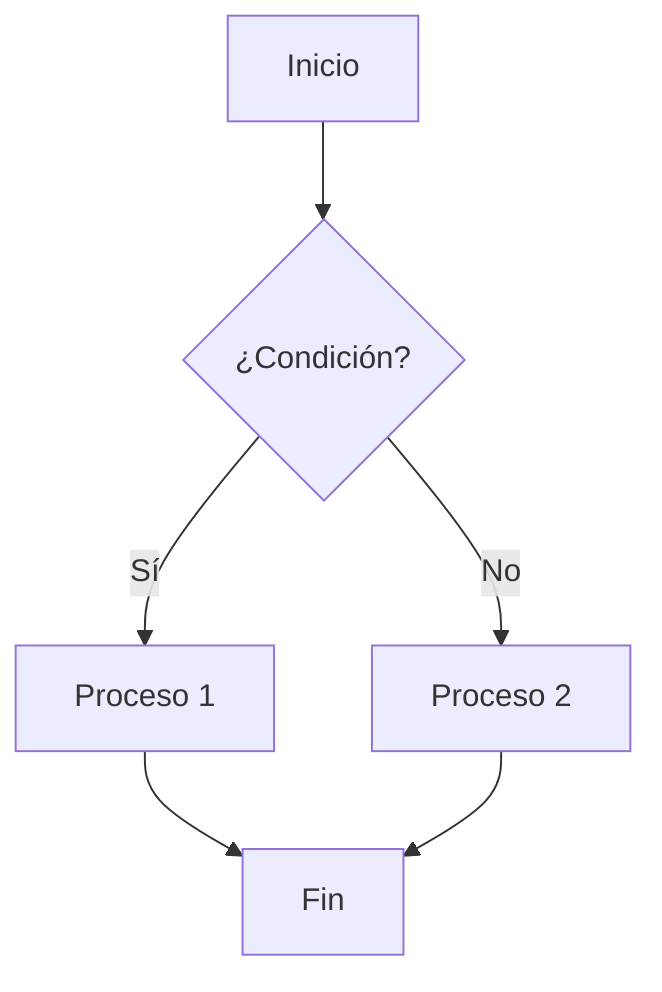
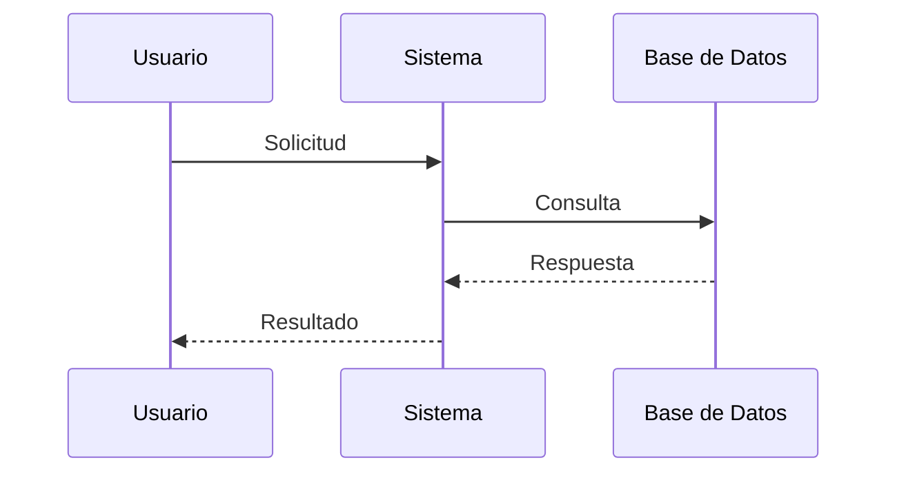
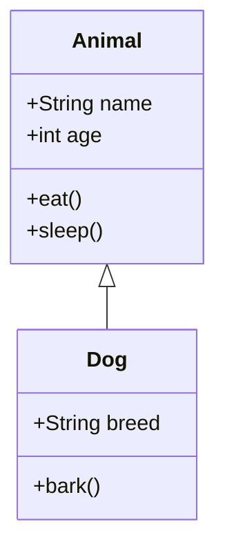

# 🧜‍♀️ Mermaid Live Editor

Un editor en vivo para diagramas Mermaid con interfaz moderna y funcionalidades avanzadas. Perfecto para crear, editar y visualizar diagramas de flujo, secuencia, clases y más.

## 🚀 Características

### ✨ Editor Avanzado
- **Editor de código** con sintaxis highlighting
- **Vista previa en tiempo real** con renderizado automático
- **Carga de archivos** (.md, .mmd, .txt)
- **Descarga de diagramas** en formato Mermaid
- **Plantillas predefinidas** para diferentes tipos de diagramas

### 🎨 Interfaz Moderna
- **Diseño responsivo** que se adapta a cualquier dispositivo
- **Tema claro/oscuro** automático según preferencias del sistema
- **Vista dividida** configurable (editor + vista previa)
- **Modo pantalla completa** para mejor experiencia
- **Controles de zoom** para ajustar el tamaño de los diagramas

### 🔧 Funcionalidades
- **Atajos de teclado** para mayor productividad
- **Validación de sintaxis** en tiempo real
- **Contador de líneas y caracteres**
- **Ejemplos interactivos** para aprender rápidamente
- **Prevención de pérdida de datos** al cerrar la página

## 📊 Tipos de Diagramas Soportados

- **Flowchart** - Diagramas de flujo
- **Sequence Diagram** - Diagramas de secuencia
- **Class Diagram** - Diagramas de clases
- **State Diagram** - Diagramas de estado
- **Entity Relationship** - Diagramas ER
- **Gantt Chart** - Cronogramas
- **Pie Chart** - Gráficos circulares
- **User Journey** - Mapas de experiencia de usuario
- **Git Graph** - Gráficos de Git

## 🛠️ Tecnologías Utilizadas

- **HTML5** - Estructura semántica
- **CSS3** - Estilos modernos con variables CSS y Grid/Flexbox
- **JavaScript ES6+** - Funcionalidad interactiva con clases y async/await
- **Mermaid.js v11.4.0** - Renderizado de diagramas
- **GitHub Pages** - Hosting estático

## 🚀 Uso

### Acceso Directo
Visita la aplicación en: [https://ericcgame.github.io/MermaidLiveEditor](https://ericcgame.github.io/MermaidLiveEditor/)

### Uso Local
1. Clona o descarga este repositorio
2. Abre `index.html` en tu navegador
3. ¡Comienza a crear diagramas!

## 📝 Ejemplos de Uso

### Diagrama de Flujo Básico


### Diagrama de Secuencia


### Diagrama de Clases


## ⌨️ Atajos de Teclado

| Atajo | Función |
|-------|---------|
| `Ctrl + S` | Descargar código |
| `Ctrl + O` | Cargar archivo |
| `F11` | Pantalla completa |
| `Escape` | Salir de pantalla completa |
| `Tab` | Indentar línea |
| `Shift + Tab` | Des-indentar línea |

## 🎯 Funcionalidades Principales

### 1. Editor de Código
- Área de texto con fuente monoespaciada
- Indentación automática con Tab
- Placeholder con ejemplo básico
- Contador de líneas y caracteres en tiempo real

### 2. Vista Previa
- Renderizado automático con debounce de 500ms
- Controles de zoom (0.8x a 1.5x)
- Manejo de errores con mensajes descriptivos
- Animaciones suaves para transiciones

### 3. Gestión de Archivos
- Carga de archivos locales (.md, .mmd, .txt)
- Descarga del código en formato .mmd
- Validación de archivos antes de cargar

### 4. Plantillas
- Selector desplegable con tipos de diagramas
- Plantillas predefinidas para cada tipo
- Ejemplos interactivos en la parte inferior

### 5. Controles de Vista
- Vista dividida (editor + vista previa)
- Solo editor
- Solo vista previa
- Modo pantalla completa

## 🔧 Configuración para GitHub Pages

### Opción 1: Desde la Interfaz Web
1. Ve a tu repositorio en GitHub
2. Navega a **Settings** > **Pages**
3. En **Source**, selecciona **Deploy from a branch**
4. Selecciona la rama **main** y la carpeta **/ (root)**
5. Haz clic en **Save**

### Opción 2: Usando GitHub Actions
Crea `.github/workflows/deploy.yml`:

```yaml
name: Deploy to GitHub Pages

on:
  push:
    branches: [ main ]

jobs:
  deploy:
    runs-on: ubuntu-latest
    steps:
    - uses: actions/checkout@v3
    
    - name: Deploy to GitHub Pages
      uses: peaceiris/actions-gh-pages@v3
      with:
        github_token: ${{ secrets.GITHUB_TOKEN }}
        publish_dir: ./mermaid-editor
```

## 📱 Compatibilidad

### Navegadores Soportados
- ✅ Chrome 90+
- ✅ Firefox 88+
- ✅ Safari 14+
- ✅ Edge 90+

### Dispositivos
- ✅ Desktop (1024px+)
- ✅ Tablet (768px - 1023px)
- ✅ Mobile (320px - 767px)

## 🤝 Contribuciones

Las contribuciones son bienvenidas. Para contribuir:

1. Fork el proyecto
2. Crea una rama para tu feature (`git checkout -b feature/AmazingFeature`)
3. Commit tus cambios (`git commit -m 'Add some AmazingFeature'`)
4. Push a la rama (`git push origin feature/AmazingFeature`)
5. Abre un Pull Request

## 📄 Licencia

Este proyecto está bajo la Licencia MIT. Ver el archivo `LICENSE` para más detalles.

## 🙏 Agradecimientos

- [Mermaid.js](https://mermaid-js.github.io/) - Por la increíble librería de diagramas
- [GitHub Pages](https://pages.github.com/) - Por el hosting gratuito
- Comunidad de desarrolladores por el feedback y sugerencias

## 📞 Soporte

Si encuentras algún problema o tienes sugerencias:

1. Abre un [Issue](https://github.com/tu-usuario/mermaid-editor/issues)
2. Describe el problema detalladamente
3. Incluye capturas de pantalla si es necesario

---

**¡Disfruta creando diagramas increíbles! 🎨✨**
